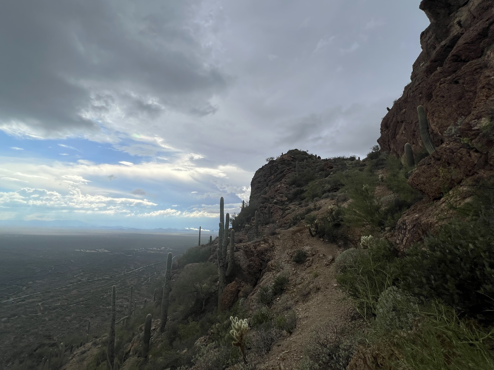
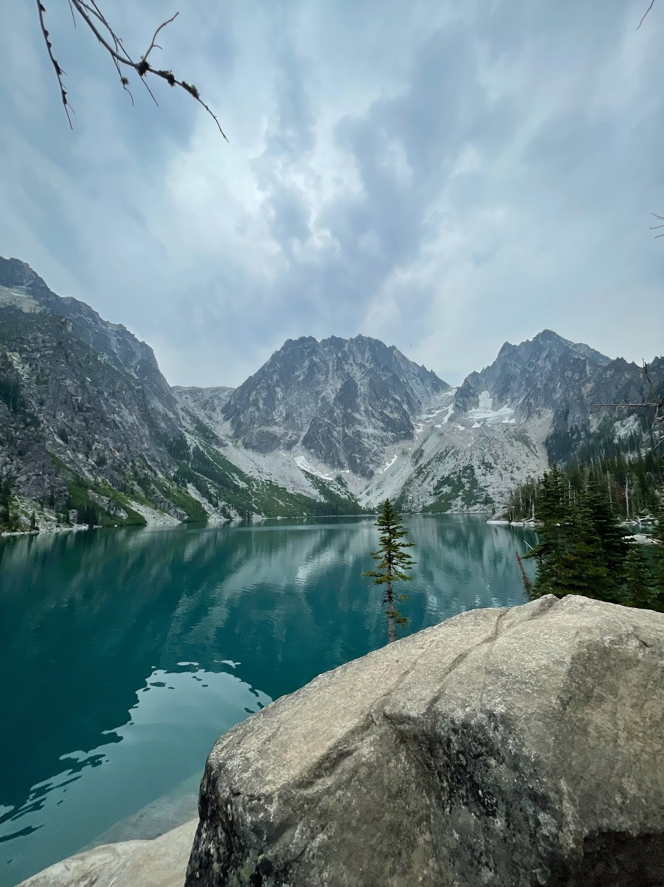
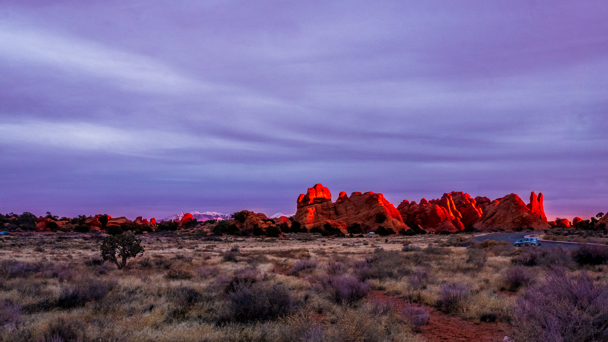

## Outdoor Guiding

Outdoor education is a side-passion of mine. It began the summer after finishing undergraduate at Purdue where I guided 21-day overnight trips across the Hawaiian islands through [Wilderness Adventures](https://www.wildernessadventures.com). Here, I discovered a passion for teaching new skills and life-long hobbies while cultivating a love for the outdoors. As a part of this, I earned my Wilderness First Responder (WFR) to make sure I am leading with safety in mind. 

Now, I live in Austin, TX where I guide outdoor trips for a nonprofit called [Explore Austin](https://exploreaustin.org). My favorite activities to guide are mountain biking, canoeing, and general outdoor medicine/skills. It is incredibly rewarding to give back to the community & get to play outside on weekends with a world-changing organization. During the summers, we guide week-long overnight trips where the kids put the skills they learned during the year to the test. The 2024 summer we went on a week-long canoe trip together! 

## Pictures from playing outside

Some photos shown here are from guiding trips: Although most are from making the best of every weekend. My passions extend from delving into composites, inverse problems, and research in general to hearing about how others have engaged the outdoors. Share your latest adventures! Don't hesitate to connect and share some the pics you've captured along the trail.

